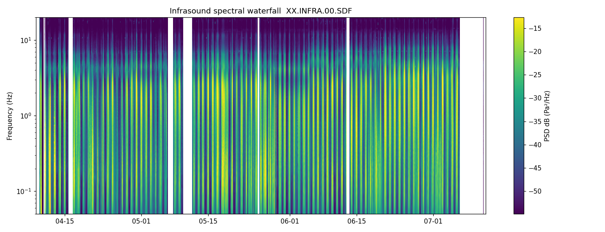

# infrasound-monitor

Acquire, convert, and visualize [Infiltec INFRA20](https://www.infiltec.com/Infrasound@home/)
infrasound data using **standard seismological formats** (miniSEED + StationXML),
so the data is compatible out-of-the-box with ObsPy, Swarm, PQLX, and the wider
FDSN/Raspberry Shake toolchain.

This replaces [AmaSeis](https://www.iris.edu/hq/) for infrasound use: AmaSeis stores
data in a nonstandard hourly `.Z` format with no embedded calibration. Here the data
is calibrated, self-describing, and portable.

## Why these formats

- **miniSEED** is the FDSN standard for geophysical time series, including pressure/
  infrasound. Samples are stored as raw integer **counts** (Steim2-compressed, ~56% of
  the AmaSeis size), and the counts→Pascals calibration lives in the metadata — the
  same convention used by Raspberry Boom and professional infrasound arrays.
- **StationXML** carries the sensor identity and the `1000 counts/Pa` INFRA20 response,
  so any tool can convert to Pascals (`tr.remove_sensitivity(inv)`).
- Channel code **`SDF`** = `S` short-period (10–80 sps) · `D` pressure sensor ·
  `F` infrasound ([FDSN source identifiers](https://docs.fdsn.org/projects/source-identifiers/)).

## Install

```bash
pip install -e .
```

## Usage

### 1. Convert existing AmaSeis data → miniSEED archive (Phase 1)

```bash
infra-convert "Y:/AmaSeis" "C:/Users/you/infra-archive" \
    --network XX --station INFRA --location 00
```

Writes a SeisComP Data Structure (SDS) archive plus `station.xml`:

```
infra-archive/
  station.xml
  2026/XX/INFRA/SDF.D/XX.INFRA.00.SDF.D.2026.<julday>
```

Consecutive hours are merged into gap-free, single-rate traces; missing hours become
explicit gaps. (AmaSeis only bins to the hour, so within a run sample times may differ
from wall-clock by <~0.3 s — negligible for infrasound.)

### 2. Spectral waterfall over a date range (Phase 2 — primary display)

```bash
infra-waterfall "C:/Users/you/infra-archive" \
    --start 2026-04-09 --end 2026-07-12 \
    --out waterfall.html --cache grid.npz
```

Produces a **self-contained interactive HTML** (open in any browser, no server): time ×
frequency, PSD in dB (Pa²/Hz). `--cache` stores the hourly PSD grid so re-rendering is
instant. This is the display for **before/after comparison** (e.g. a datacenter appearing
as a new persistent horizontal line).



The diurnal (day/night) cycle shows as vertical banding; data gaps are blank columns; a
persistent narrowband source would appear as a horizontal line.

### 3. Live acquisition from the INFRA20 serial port

```bash
infra-acquire COM4 "C:/Users/you/infra-archive"
```

Reads the INFRA20's serial stream (**9600 8N1, one signed integer count per
CRLF line, ~51.4 sps** — confirmed against hardware), timestamps samples from the
system clock, and appends gap-free, single-rate segments to the SDS day files,
splitting automatically at UTC midnight and (re)writing `station.xml`. A genuine
serial dropout leaves an explicit gap; a USB glitch triggers reconnect. Only one
program can hold the port, so **close AmaSeis first** — this replaces it.

```bash
infra-acquire COM4 --sniff          # just print raw lines to eyeball the framing
```

### 4. Helicorder / drum view (Phase 3 — optional)

```bash
infra-helicorder "C:/Users/you/infra-archive" 2026-07-01 --out day.png
```

The classic drum-recorder view AmaSeis emulated. Note **Swarm** (load the archive) and
ObsPy already provide interactive helicorder + spectrogram views, so a bespoke raw-data
UI may be unnecessary.

### Use the data in other tools

```python
from obspy import read, read_inventory
st  = read("infra-archive/2026/XX/INFRA/SDF.D/XX.INFRA.00.SDF.D.2026.182")
inv = read_inventory("infra-archive/station.xml")
st.remove_sensitivity(inv)   # counts -> Pascals
st.spectrogram()             # or st.plot(type="dayplot")
```

Or point **Swarm** / a **SeedLink**/**FDSNWS** server at the SDS archive.

For a ready-made standard-tools analysis, `tools/analyze.py` builds a calibrated
**PPSD** (McNamara–Buland, `special_handling="hydrophone"` for the flat pressure
response) plus an optional calibrated dayplot, and reports whether any persistent
narrowband tone stands out above the background — the datacenter test:

```bash
python tools/analyze.py "C:/Users/you/infra-archive" \
    --start 2026-04-09 --end 2026-07-12 --dayplot 2026-07-01
```

PSD is pressure (Pa²/Hz), so it sets `db_bins` for pressure, not ObsPy's seismic
default (which would clip pressure PSD at its −50 dB top bin).

## Status

- [x] Phase 1 — AmaSeis `.Z` reader, `.Z`→miniSEED/SDS converter, StationXML calibration
- [x] Phase 2 — hourly PSD reduction + interactive spectral waterfall
- [~] Phase 3 — helicorder wrapper (thin; may defer to Swarm/ObsPy)
- [x] Live acquisition daemon (serial INFRA20 → miniSEED SDS) — `infra-acquire`, framing confirmed
- [ ] Serve the live archive over SeedLink for real-time views

## Layout

```
src/infrasound_monitor/
  config.py      constants, calibration, station identity
  amaseis.py     legacy .Z reader
  metadata.py    StationXML / INFRA20 response
  convert.py     .Z -> miniSEED SDS archive
  psd.py         archive -> hourly PSD grid (waterfall backbone)
  waterfall.py   PSD grid -> interactive HTML waterfall
  helicorder.py  drum/dayplot view (optional)
  acquire.py     live serial acquisition (design/stub)
```
